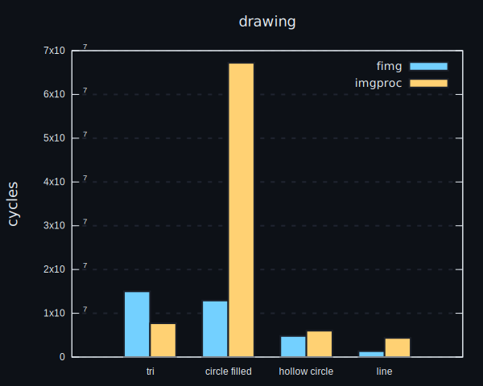

## a series of benchmarks, comparing different image processing crates

including:
- [fimg](https://crates.io/crates/fimg)
- [imageproc](https://crates.io/crates/imageproc)
- [image](https://crates.io/crates/image)
- [blud](https://crates.io/crates/blud)
- [blurslice](https://crates.io/crates/blurslice)
- [resize](https://crates.io/crates/resize)
- [opencv](https://crates.io/crates/opencv)

### how to run benchmarks

step 1: unhew. `cargo install --git https://github.com/bend-n/hew && hew data.png data.imgbuf && hew small_data.png small_data.imgbuf`
step 2: run. `cargo bench`